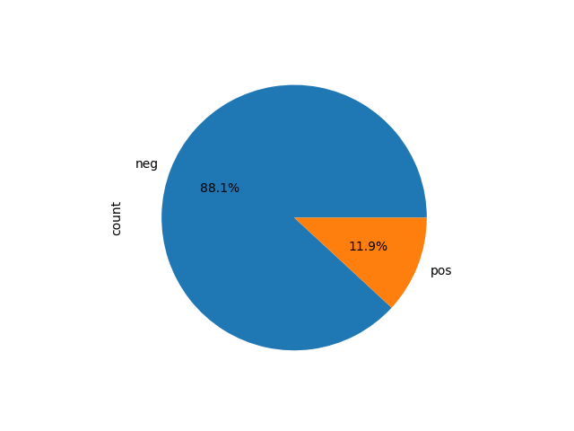

# KoSentiment: Classifying Sentiments in Conversational Text from Korean Language

이 프로젝트는 [AI Hub](https://aihub.or.kr/aihubdata/data/view.do?currMenu=115&topMenu=100&dataSetSn=86)에서 제공하는 한국어 감성 대화 말뭉치 데이터를 활용하여 자연어 처리 및 감정 분석을 수행합니다. 분석에 사용된 데이터는 크라우드 소싱을 통해 참가한 1,500명이 기여한 음성 및 한국어 코퍼스로 구성되어 있으며, 발화자의 구체적인 감정 상태를 태그하고 있습니다.

 * Size: 460K(+180K)
 * Language: Korean-centric

🔍 See More
[data_description.pdf](data/data_description.pdf)

## Dataset Description

AI Hub에서 제공한 한국어 말뭉치 Raw Data는 사람과 시스템 간의 대화 세션으로 이루어 져 있으며, 아래와 같은 구조의 JSON 형식으로 저장되어 있습니다.

```
{
    "profile": {
        "persona-id": "Pro_05349", 
        "persona": {
            "persona-id": "A02_G02_C01", 
            "human": ["A02", "G02"], 
            "computer": ["C01"]
        }, 
        "emotion": {
            "emotion-id": "S06_D02_E18", 
            "type": "E18", 
            "situation": ["S06", "D02"]
        }
    }, 
    "talk": {
        "id": {
            "profile-id": "Pro_05349", 
            "talk-id": "Pro_05349_00053"
        }, 
        "content": {
            "HS01": "일은 왜 해도 해도 끝이 없을까? 화가 난다.", 
            "SS01": "많이 힘드시겠어요. 주위에 의논할 상대가 있나요?", 
            "HS02": "그냥 내가 해결하는 게 나아. 남들한테 부담 주고 싶지도 않고.", 
            "SS02": "혼자 해결하기로 했군요. 혼자서 해결하기 힘들면 주위에 의논할 사람을 찾아보세요. ", 
            "HS03": "", 
            "SS03": ""
        }
    }
}
```

데이터 구축 설명자료에 따르면, Raw Data의 감정 상태(`profile.emotion.type`)는 아래와 같이 60가지의 세부감정으로 태그되어 있습니다.

| Emotion Code | Emotion Description   |
|--------------|------------------------|
| E10          | 분노                   |
| E11          | 툴툴대는               |
| E12          | 좌절한                 |
| E13          | 짜증내는               |
| E14          | 방어적인               |
| E15          | 악의적인               |
| E16          | 안달하는               |
| E17          | 구역질 나는            |
| E18          | 노여워하는             |
| E19          | 성가신                 |
| E20          | 슬픔                   |
| E21          | 실망한                 |
| E22          | 비통한                 |
| E23          | 후회되는               |
| E24          | 우울한                 |
| E25          | 마비된                 |
| E26          | 염세적인               |
| E27          | 눈물이 나는            |
| E28          | 낙담한                 |
| E29          | 환멸을 느끼는           |
| E30          | 불안                   |
| E31          | 두려운                 |
| E32          | 스트레스 받는           |
| E33          | 취약한                 |
| E34          | 혼란스러운             |
| E35          | 당혹스러운             |
| E36          | 회의적인               |
| E37          | 걱정스러운             |
| E38          | 조심스러운             |
| E39          | 초조한                 |
| E40          | 상처                   |
| E41          | 질투하는               |
| E42          | 배신당한               |
| E43          | 고립된                 |
| E44          | 충격 받은              |
| E45          | 가난한, 불우한         |
| E46          | 희생된                 |
| E47          | 억울한                 |
| E48          | 괴로워하는             |
| E49          | 버려진                 |
| E50          | 당황                   |
| E51          | 고립된(당황한)         |
| E52          | 남의 시선을 의식하는  |
| E53          | 외로운                 |
| E54          | 열등감                 |
| E55          | 죄책감의               |
| E56          | 부끄러운               |
| E57          | 혐오스러운             |
| E58          | 한심한                 |
| E59          | 혼란스러운(당황한)     |
| E60          | 기쁨                   |
| E61          | 감사하는               |
| E62          | 신뢰하는               |
| E63          | 편안한                 |
| E64          | 만족스러운             |
| E65          | 흥분                   |
| E66          | 느긋                   |
| E67          | 안도                   |
| E68          | 신이 난               |
| E69          | 자신하는               |

기록된 대화 자료는 발화자에 따라 각각 사람과 시스템으로 구분되어 있으며, 발화 시점에 따라 01-06의 값을 가집니다. 발화자와 대화 턴을 조합하여 talk.content의 Key 값으로 하고 Value에는 실제로 오갔던 대화 텍스트가 저장되어 있습니다.

| 항목             | 상세    | ID          |
|------------------|---------|-------------|
| 사람 대화        | Human Speech | HS          |
| 시스템 응답      | System Speech | SS          |
| 대화 턴          | Turn        | 01~06        |

### 주의사항

감정 분류 태그는 Human Speech의 첫번째 대화를 기준으로 태그되어 있습니다! 두번째 이상의 대화턴에 대해서는 감정 분류 태그를 알 수 없습니다.

## Preprocess Datasets

`DataProcessor.py`를 통해 다음과 같은 두 단계의 전처리 작업을 일차적으로 수행했습니다.

1. JSON 파일을 CSV로 변환
주어진 JSON 파일을 읽어 CSV 파일로 변환하였습니다. 이 과정에서 다음과 같은 작업이 이루어졌습니다:

 * 각 예시에서 감정 레이블과 첫 번째 인간 발화를 추출합니다.
 * CSV 파일에 'emotion' 및 'sentence' 필드를 생성하여 추출된 감정 레이블과 발화를 기록합니다.

2. 데이터 전처리 및 토큰화
CSV 파일을 읽어들여 다음과 같은 작업을 수행하여 데이터를 전처리하고 토큰화했습니다:

 * 'emotion' 열의 레이블을 'pos' 및 'neg'로 변환합니다.
 * KoBERT 토크나이저를 사용하여 문장을 토큰화하고, 토큰화된 결과를 'tokenized_sentence' 열에 추가합니다.
 * 토큰을 정리하는 clean_tokens 함수를 정의하고, 이를 적용하여 정리된 토큰을 'cleaned_tokens' 열에 추가합니다.

이렇게 전처리된 데이터프레임은 감정 레이블, 토큰화된 문장, 그리고 정리된 토큰 정보를 담고 있습니다. 코드에서는 'kykim/bert-kor-base'를 기본 BERT 모델로 사용하였으며, 필요에 따라 bert_model_name을 수정하여 사용할 수 있습니다.

| emotion | sentence | label | tokenized_sentence | cleaned_tokens |
|---------|----------|-------|--------------------|-----------------|
| E18     | 일은 왜 해도 해도 끝이 없을까? 화가 난다. | 0 | ['일은', '왜', '해도', '해도', '끝이', '없을까', '?', '화가', '난다'] | ['일은', '왜', '해도', '해도', '끝이', '없을까', '화가', '난다'] |
| E18     | 이번 달에 또 급여가 깎였어! 물가는 오르는데 월급만 자꾸 깎이니까 너무 화가 나. | 0 | ['이번', '달에', '또', '급여', '##가', '깎', '##였어', '!', '물가', '는', '오르는데', '월급만', '자꾸', '깎이니까', '너무', '화가', '나'] | ['이번', '달에', '또', '급여', '깎', '물가', '오르는데', '월급만', '자꾸', '깎이니까', '너무', '화가', '나'] |
| E18     | 회사에 신입이 들어왔는데 말투가 거슬려. 그런 애를 매일 봐야 한다고 생각하니까 | 0 | ['회사에', '신입', '##이', '들어왔', '##는데', '말투', '##가', '거슬려', '.', '그런', '애를', '매일', '봐야', '한다고', '생각하니까'] | ['회사에', '신입', '들어왔', '말투', '거슬', '그런', '애를', '매일', '봐야', '한다고', '생각하니까'] |
| E18     | 직장에서 막내라는 이유로 나에게만 온갖 심부름을 시켜. 일도 많은 데 정말 분하고 ... | 0 | ['직장', '##에서', '막내', '##라는', '이유로', '나에게', '##만', '온갖', '심부름', '##을', '시켜', '.', '일도', '많은', '데', '정말', '분하고', '...'] | ['직장', '막내', '이유로', '나에게', '온갖', '심', '시켜', '일도', '많은', '데', '정말', '분하고'] |
| E18     | 얼마 전 입사한 신입사원이 나를 무시하는 것 같아서 너무 화가 나. | 0 | ['얼마', '전', '입사', '##한', '신입', '##사원', '##이', '나를', '무시하는', '것', '같아서', '너무', '화가', '나'] | ['얼마', '전', '입사', '신입', '나를', '무시', '것', '같아서', '너무', '화가', '나'] |
| E18     | 직장에 다니고 있지만 시간만 버리는 거 같아. 진지하게 진로에 대한 고민이 생겨. | 0 | ['직장', '##에', '다니고', '있지만', '시간', '##만', '버리는', '거', '같아', '.', '진지하게', '진로에', '대한', '고민이', '생겨', '.'] | ['직장', '다니고', '있지만', '시간', '버리는', '거', '같아', '진지하게', '진로에', '대한', '고민이', '생겨'] |
| E18     | 성인인데도 진로를 아직도 못 정했다고 부모님이 노여워하셔. 나도 섭섭해. | 0 | ['성인', '##인데도', '진로', '##를', '아직도', '못', '정', '했다고', '부모님', '##이', '노여워하셔', '.', '나도', '섭섭해', '.'] | ['성인', '진로', '아직도', '못', '정', '부모님이', '노', '나도', '섭섭해'] |
| E66     | 퇴사한 지 얼마 안 됐지만 천천히 직장을 구해보려고. | 1 | ['퇴', '##사한', '지', '얼마', '안', '됐', '##지만', '천천히', '직장', '##을', '구해', '##보려고', '.'] | ['퇴', '지', '얼마', '안', '됐', '천천히', '직장', '구해'] |
| E37     | 졸업반이라서 취업을 생각해야 하는데 지금 너무 느긋해서 이래도 되나 싶어. | 0 | ['졸업', '##반이', '##라서', '취업', '##을', '생각해', '##야', '하는데', '지금', '너무', '느긋해서', '이래도', '되나', '싶어', '.'] | ['졸업', '취업', '생각해', '하는데', '지금', '너무', '느', '이래도', '되나', '싶어'] |
| E66     | 요즘 직장생활이 너무 편하고 좋은 것 같아! | 1 | ['요즘', '직장', '##생활', '##이', '너무', '편하고', '좋은', '것', '같아', '!'] | ['요즘', '직장', '너무', '편하고', '좋은', '것', '같아'] |

## Imbalanced Classification and Data Augmentation

일차 전처리 이후 Training Data의 label 분포는 다음과 같습니다.



위 그래프에서 확인할 수 있듯이, Positive로 태그된 텍스트가 Negative로 태그된 텍스트보다 부족한 경향이 있습니다. 이러한 불균형한 클래스 분포를 해결하기 위해, 먼저 Minor Class의 데이터만을 따로 추출한 후, `KoGPT2DataAugmentor.py`를 사용하여 데이터 증강을 시도했습니다. 이 과정에서 다음 두 가지 가정을 기반으로 작업하였습니다.

1. 텍스트 문장에 포함된 각 단어는 긍정적인지 부정적인지의 감정을 전달한다.
2. 긍정적인 감정을 나타내는 단어들은 긍정적인 감정의 다른 단어들과 함께 나타날 가능성이 높다.

`KoGPT2DataAugmentor.py`에서는 긍정적인 문장이 담긴 데이터프레임을 받아와 각 문장에 대해 KoGPT-2 모델을 사용하여 새로운 문장을 생성합니다. 주어진 초기 문장을 바탕으로 생성된 문장의 다음 토큰은 모델의 출력 중 상위 k개 중에서 랜덤으로 선택됩니다. 생성된 문장은 원래 문장에서 추출되어 원본 문장과 대체된 후, 감정 레이블과 함께 저장 됩니다.

Positive 텍스트로만 구성된 Subset `pos_training.csv`는 총 6126개의 Example로 구성되어 있으며, `KoGPT2DataAugmentor.py`를 통해 추가로 6126개의 Example을 생성 한 뒤, 새로운 학습 데이터로 추가하였습니다.

### Augmented Data Processing

KoGPT-2를 이용해 생성된 자료에 대해 다음의 두 단계 전처리를 수행하였습니다.

1. RegEx `(r'n(?=(?:(?:[^"]*"){2})*[^"]*$)')`를 사용하여 따옴표 안에 없는 모든 줄 바꿈 문자를 공백으로 바꿉니다. 각 행의 'sentence' 필드에서 첫 번째 문장만 남기고 따옴표를 제거합니다.
2. `train.csv`에서와 마찬가지로 데이터 전처리와 Tokenization을 진행합니다.

### Random Undersampling

기존의 6126개 긍정문에 더해 새롭게 추가된 6126개를 합하여 모두 12252개의 Example들이 긍정적인 감정 (label=1)을 표현합니다. 

추가로, 부정적인 문장 Example에 대해 Random Undersampling을 수행하여 최종적으로 아래와 같은 Label 분포를 구하였습니다.

```
label
0    12252
1    12252
```
